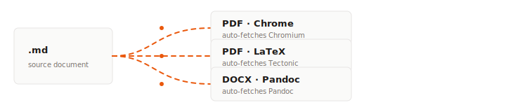

<div align="center">


# Rustmark

**A fast, Rust-powered markdown editor with a paginated live preview and print-faithful exports.**



</div>

---

## What it is

Rustmark is a desktop markdown editor built on [Tauri 2](https://tauri.app/) and Rust. It pairs a
CodeMirror editor with a **paged** live preview — what you see on screen is what lands in the PDF,
page break for page break. Exports run through Chrome, Tectonic/LaTeX, or Pandoc, each of which is
auto-fetched on first use so open-source users don't have to install a toolchain.

## Export pipeline



| Route | Engine | Installed when missing |
| --- | --- | --- |
| **PDF · Chrome** | Headless Chromium via CDP `Page.printToPDF` | Yes — pinned Chromium build fetched on demand |
| **PDF · LaTeX** | Pandoc → XeLaTeX / LuaLaTeX / Tectonic | Yes — Tectonic downloaded from GitHub releases |
| **PDF · Print dialog** | Native WKWebView print (macOS fallback) | — |
| **DOCX** | Pandoc with a paged reference template | Yes — Pandoc downloaded from GitHub releases |

## Features

- **Paginated preview.** Pages render at real US Letter size with CSS Paged Media, so page breaks
  in the preview map 1:1 onto the exported PDF.
- **Rich editor.** CodeMirror 6 with inline spellcheck (nspell + dictionary-en), a markdown
  linter, KaTeX math rendering, syntax-highlighted code blocks (highlight.js), and a visual
  table builder.
- **Document Settings drawer.** Title, author, date, header/footer, page numbering, title
  page, and table of contents — written back as YAML front matter and picked up on export.
- **Theme-aware Pandoc.** Selecting a theme (classic / modern / academic / minimal) changes the
  Pandoc font stack, line height, and geometry so the LaTeX output matches what you see.
- **Cross-platform font stacks.** Built-in per-OS defaults (macOS / Windows / Linux) with fontspec
  fallbacks for Unicode blocks so every platform produces a readable PDF out of the box.
- **YAML front matter.** `title`, `author`, `date`, `toc`, `toc-depth`, `titlepage`, `pagenumbers`,
  `theme`, and `header-includes` all flow through to the export.
- **Zero-install exports.** First export auto-provisions Chromium / Tectonic / Pandoc into
  `~/Library/Caches/rustmark`. No Homebrew, no MacTeX, no pre-flight.
- **Honest error surfacing.** When a LaTeX engine fails, Rustmark collects every engine's stderr and
  shows you the actual root cause — not just "engine not found".

## Getting started

```bash
# install JS deps
npm install

# run the desktop app in dev mode
npm run tauri dev

# build a release bundle
npm run tauri build
```

> Rust (stable) and Node 20+ are required. Everything else (Chromium, Tectonic, Pandoc) is fetched
> automatically the first time you use a given export.

## Project layout

```
src/              — editor frontend (CodeMirror, markdown-it, preview paging)
src-tauri/        — Rust backend (exports, auto-fetch, print)
  └─ src/lib.rs   — export_pdf_chromium / export_pdf_pandoc / export_docx
assets/           — logo + animated README graphics
```

## Mascot

<div align="center">

<br/>
<em>Rustmark's crab, after the Rust mascot — with a markdown hash hovering overhead.</em>
</div>

## License

MIT.
